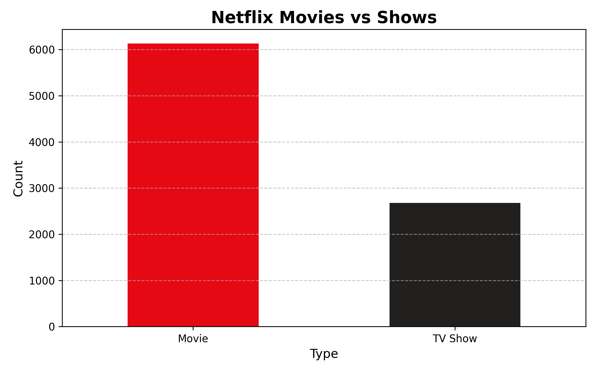
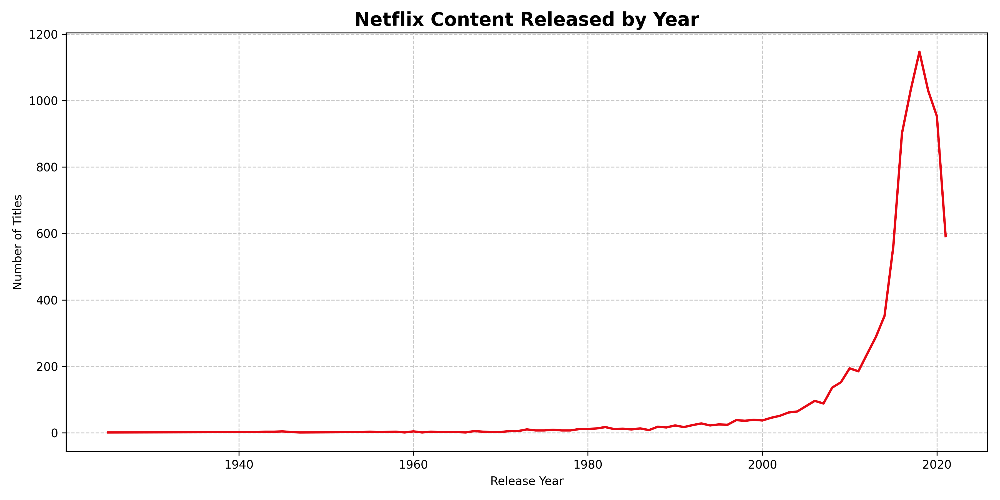
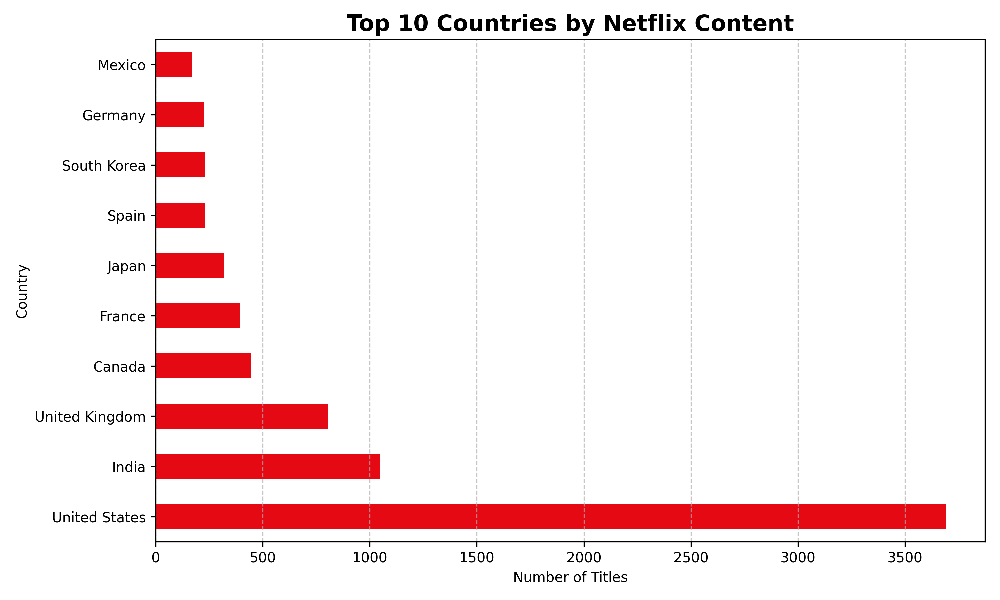
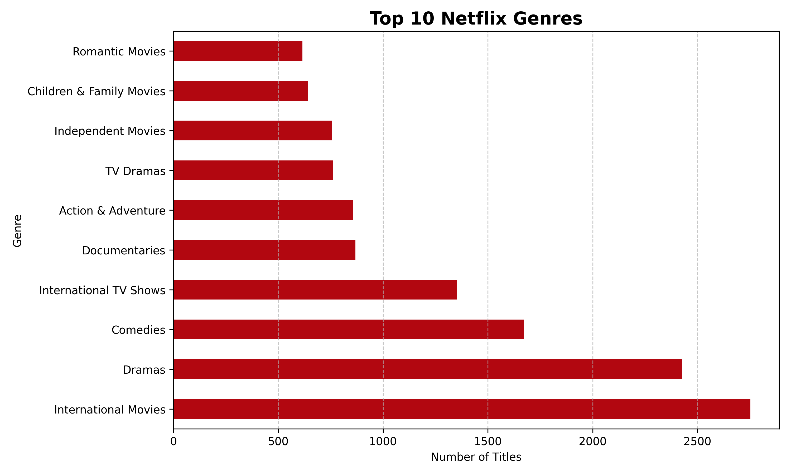
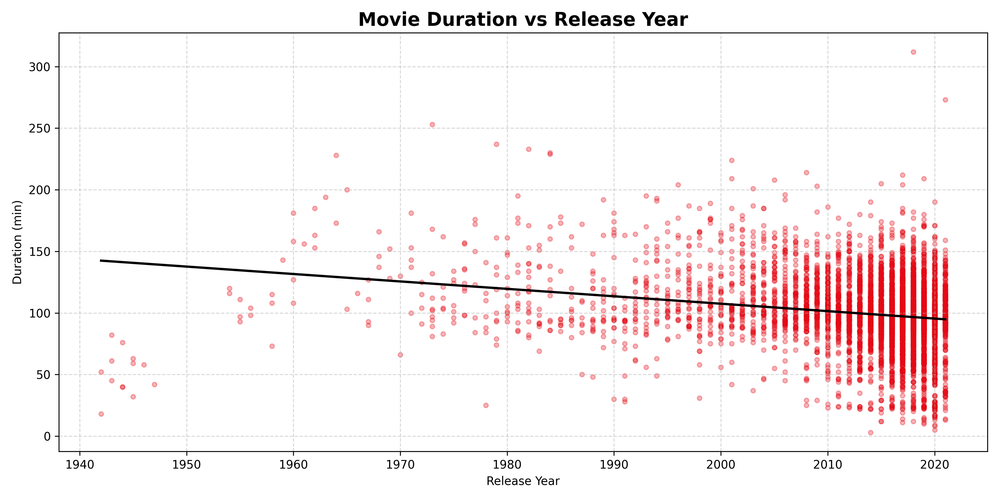

# Netflix Data Analysis

This project analyzes Netflix titles using Python, pandas, matplotlib and SQLite.

## Project Overview

The goal of this project is to practice basic data analysis workflows, including data cleaning, visualization and SQL-based analysis.

The dataset contains information about Netflix movies and TV shows, such as title, type, release year, country, rating, duration and genres.

## Technologies Used

- Python
- pandas
- matplotlib
- NumPy
- SQLite
- PyCharm
- GitHub

## Main Features

- Load and clean Netflix CSV data
- Analyze movies and TV shows
- Visualize content distribution
- Analyze release years, countries and genres
- Examine movie duration patterns
- Store cleaned data in an SQLite database
- Run SQL queries from Python
- Save charts as image files

## Visualizations

### Movies vs TV Shows

### Netflix Content Released by Year

### Top 10 Countries by Netflix Content

### Top 10 Netflix Genres

### Movie Duration vs Release Year

## SQL Analysis

The project also uses SQLite to store the cleaned dataset and run SQL queries.

## What I Learned

### During this project, I practiced:

- working with CSV files
- using pandas DataFrames
- cleaning real-world data
- creating visualizations with matplotlib
- using SQLite databases
- writing SQL queries
- organizing a Python project into multiple files 

## Dataset

The dataset used in this project is the Netflix Titles dataset from Kaggle.